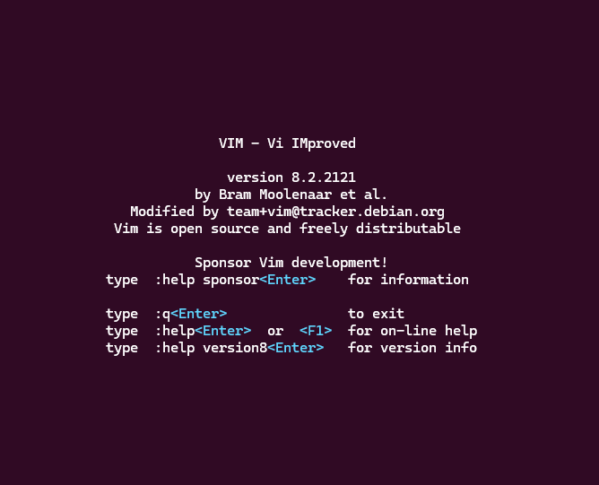

# Vim Basics
`Vim` is a terminal text-editor that is customizable and extensible. `Vim` distinguishes between "command mode" where the user enters commands, and "edit mode" where the user enters text.

On macOS and Linux, `Vim` is typically installed by default. For users running WSL, you can install `Vim` from your terminal by entering the command:
```bash
sudo apt-get install vim
```
From there, to open `Vim`, simply enter:
```bash
vim
```
This will open a screen like the following, displaying info about `Vim` and some instructions for exiting the editor or finding help.



One of the more important concepts in `Vim` is working with "modes." Depending on the mode, typed characters can be interpreted by `Vim` as sequences of commands or they can be inserted as text. There are 14 modes, but there are only three that we need to learn about for this lesson: `Normal`, `Command-line` mode and `Insert` mode. For more information about modes, follow [this link](https://vimhelp.org/intro.txt.html#vim-modes-intro) to the official documentation.

## Basic Commands:
In everyday use, you only need to worry about three main modes in Vim:

* Normal mode: for moving around and running commands

* Insert mode: for typing and editing text

* Command-line mode: for things like `:w` (save the file), `/search` (search for text), or `:q!` (quit without saving).

Here's a quick chart on switching between the relevant modes:

| You are in $\downarrow$ | To Normal                                                                                                                  | To Insert                                                                              | To Cmdline            |
| ---                     |  ---                                                                                                                       |  ---                                                                                   |  ---                  |
| Normal                  | (you're already here)                                                                                                      | `i` – insert before cursor<br>`A` – append at end of line<br>`o` – open new line below | :, /, ?, !            |
| Insert                  | Esc                                                                                                                        | (you're already here)                                                                  | N/A                   |
| Command-line            | `Enter` executes the command, returning to normal mode<br>`CTRL+C` or `ESC` quits to normal mode without executing command | :start                                                                                 | (you're already here) |

For a more complete chart showing the switch commands between all 7 BASIC modes, follow [this link](https://vimhelp.org/intro.txt.html#mode-switching) to the official documentation.

### Open a File
```bash
vim filename.txt
```

* Opens the file for editing. If one doesn't exist, `vim` automatically creates a new one.

### Edit or Insert Text

* Switch to Insert mode by typing `i`.

* You can now type and edit text as in a regular editor.

### Save Changes

* Ensure you are in Normal mode by pressing the `Esc` key.

* Type `:w` and press `Enter` (This writes the file to disk.)

### Save and Quit

* Press `Esc`, then type:

```vim
:wq
```
and press `Enter`.
### Quit Without Saving

* Press `Esc`, then type:

```vim
:q!
```
and press `Enter`.
### Search for Text

* Begin your search by pressing `/` or `?` in Normal mode.

* `/` will search forward; `?` will search backwards.

> Forward and backward referring to where your cursor is placed in a document.
```vim
/searching_below
?searching_above
```
* Type your search term and press `Enter`:

* `n` will then repeat the search in the same direction as chosen.

* `N` will search in the opposite direction.

* `vim` uses regex by default in searches. If you're unfamiliar with using regex, [here is a lesson on using regex](https://carpentries-incubator.github.io/regex-novice-biology/), and [here is a website for testing your expressions](https://regex101.com/).

* Searches are case-sensitive by default. Add `\c` to make a search case-insensitive:

```vim
/searchterm\c
```

* Or set the option globally:

```vim
:set ignorecase
:set smartcase
```

* For literal strings (without regex): use `\v` at the start of your search.


---

[Click here](03_emacs.md) to continue to the next section to learn the basics for `Emacs`.