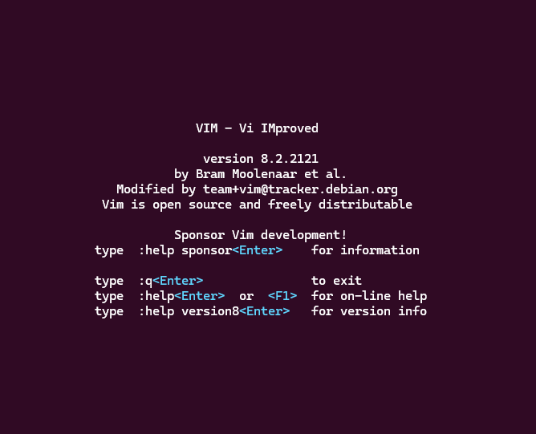

# Vim Basics
`Vim` is customizable and extensible, making it especially useful for users who want a more flexible environment at the cost of creating a slightly steeper learning curve that makes it less accessible for beginners. 

The latest version of `Vim` can be downloaded by following [this link to the official site.](https://www.vim.org/download.php). You can also install it from your terminal by running:
```bash
sudo apt-get install vim
```
From there, to open `Vim`, simply enter:
```bash
vim
```
This will open a screen like the following, displaying info about `Vim` and some instructions for exiting the editor or finding help.



One of the more important concepts in `Vim` is working with "modes." Depending on the mode, typed characters can be interpreted by `Vim` as sequences of commands or they can be inserted as text. There are 7 BASIC modes, and 7 ADDITIONAL modes which are variants of the BASIC modes. For more information about modes, follow [this link](https://vimhelp.org/intro.txt.html#vim-modes-intro) to the official documentation.

## Basic Commands:
For the basic commands in `Vim`, the only modes you'll need to switch between are Normal/Command mode, Insert mode, and Command-line/Cmdline mode. 

Here's a quick chart on switching between the relevant modes:
| FROM $\downarrow$ TO $\to$ | Normal | Insert                       | Cmdline    |
| ---                        |  ---   |  ---                         |  ---       |
| Normal                     |        | i, I, a, A, o, O, c, C, s, S | :, /, ?, ! |
| Insert                     | Esc    |                              | N/A        |
| Command-line               | *1     | :start                       |            |
For a more complete chart showing the switch commands between all 7 BASIC modes, follow [this link](https://vimhelp.org/intro.txt.html#mode-switching) to the official documentation.
*1 - Go from Command-line to Normal by:
* Hitting <CR> or <NL>, which causes the entered command to be executed.
* Deleting the complete line, such as with `CTRL+U`, and giving a final <BS>.
* Hitting `CTRL+C` or `Esc`, which quits without executing the command.

### Open a File
```bash
vim filename.txt
```
* Opens the file for editing. If one doesn't exist, `vim` automatically creates a new one.
### Edit or Insert Text
* Switch to Insert mode with one of the above commands.
* You can now type and edit text as in a regular editor.
### Save Changes
* Ensure you are in Normal mode by pressing the `Esc` key.
* Type `:w` and press `Enter` (This writes the file to disk.)
### Save and Quit
* Press `Esc`, then type:
```vim
:wq
```
and press `Enter`.
### Quit Without Saving
* Press `Esc`, then type:
```vim
:q!
```
and press `Enter`.
### Search for Text
* Begin your search by pressing `/` or `?` in Normal mode.
* `/` will search forward; `?` will search backwards.
> Forward and backward referring to where your cursor is placed in a document.
```vim
/searching_below
?searching_above
```
* Type your search term and press `Enter`:
* `n` will then repeat the search in the same direction as chosen.
* `N` will search in the opposite direction.
* `vim` uses regex by default in searches.
* Searches are case-sensitive by default. Add `\c` to make a search case-insensitive:
```vim
/searchterm\c
```
* Or set the option globally:
```vim
:set ignorecase
:set smartcase
```
* For literal strings (without regex): use `\v` at the start of your search.

---

[Click here](04_emacs.md) to continue to the next section to learn the basics for `Emacs`.