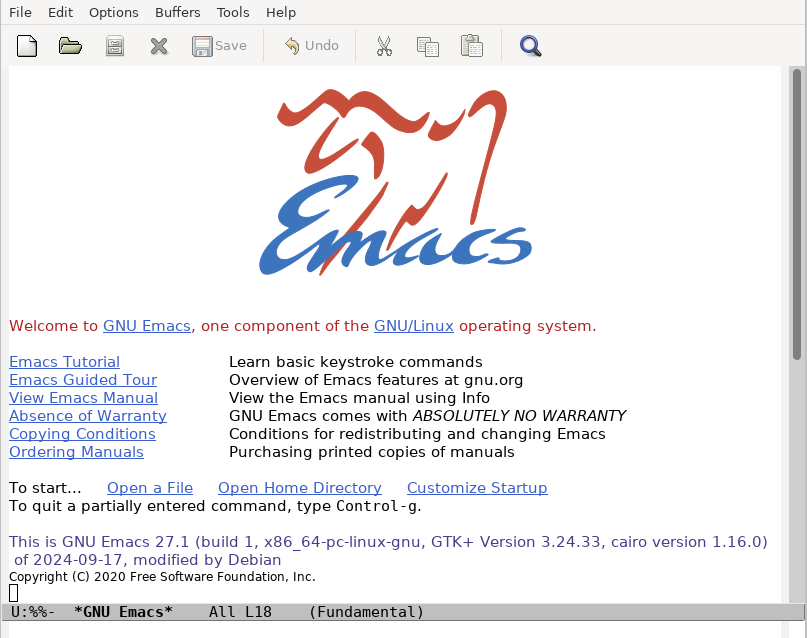

# Emacs Basics
`GNU Emacs`, or more simply: `Emacs`, is a family of text editors notable for their extensibility. As mentioned before, `Emacs` has a steeper learning curve than the other two options, with over 10,000 built-in commands and a UI which allows for these commands to be combined into automated macros, giving us the name of the software from "Editor Macros."  

The latest version of `Emacs` can be downloaded by following [this link to the official site.](https://www.gnu.org/software/emacs/download.html) You can also install it from the terminal by running:
```bash
sudo apt-get install emacs
```
You can then open `Emacs` by typing:
```bash
emacs
```
And pressing `Enter`. This will open the graphical window, which should look similar to this depending on your installation:

## Basic Commands:
`Emacs` commands will generally involve the CONTROL (CTRL or CTL) key and the META key (sometimes EDIT or ALT). It is recommended to follow along with the `Emacs Tutorial` section which is the first link visible on startup.
### Open a File
From the terminal, you can create or open a file by entering the appropriate directory and entering:
```bash
emacs filename.txt
```

* This opens the specified file in a new `Emacs` window. If the file doesn't exist yet, `Emacs` will create it when you save.

You can also start `Emacs` and open a file from within it by pressing `CTRL+X` and then `CTRL+F`.
### Edit or Insert Text

* Emacs is always in insert mode by default, so you can simply start typing.

### Save Changes

* To save your file, type `CTRL+X` followed by `CTRL+S`.

### Quit

* Type `CTRL+X` followed by `CTRL+C`. You can quit without saving by skipping the saving step.

### Search for Text

* To start a forward search, type `CTRL+S`.

* To start a backward search, type `CTRL+R`

* `Emacs` performs incremental search by default, so as you type the pattern, it immediately searches.

* Pres `CTRL+S` or `CTRL+R` again to continue searching in the same direction.

* Press `Enter` to finish the search and leave the cursor on the match.

* Press `CTRL+G` to cancel the search and return to the original position.

**Regex in Search**
By default, searching in `Emacs` is literal. 

* To use **regex** instead, type `META+CTRL+S` (`ALT+CTRL+S`).

* You can toggle between literal and regex search with `META+R` (`ALT+R`) during a search.